# Intro to AWS
Specifically S3, API Gateway and Lambda.

## Supplemental Reading

[AWS in Plain English](https://www.expeditedssl.com/aws-in-plain-english)

# AWS S3

What is S3? Cloud data storage.  Amazon calls S3 containers "buckets"; these are just named groups of files, like folders but with extra options.

## Create an S3 Bucket

Log in to the AWS Management Console, then open the Services menu and select Storage > S3.


Click to create a bucket.

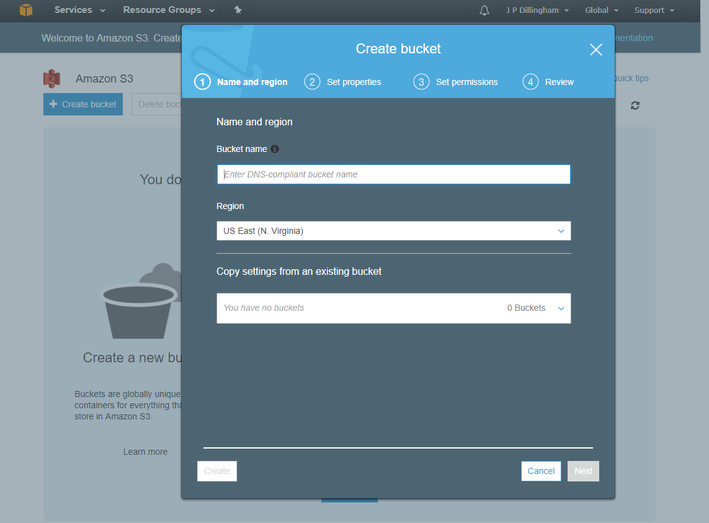

Select options for the bucket.  For this session we'll accept all of the defaults.

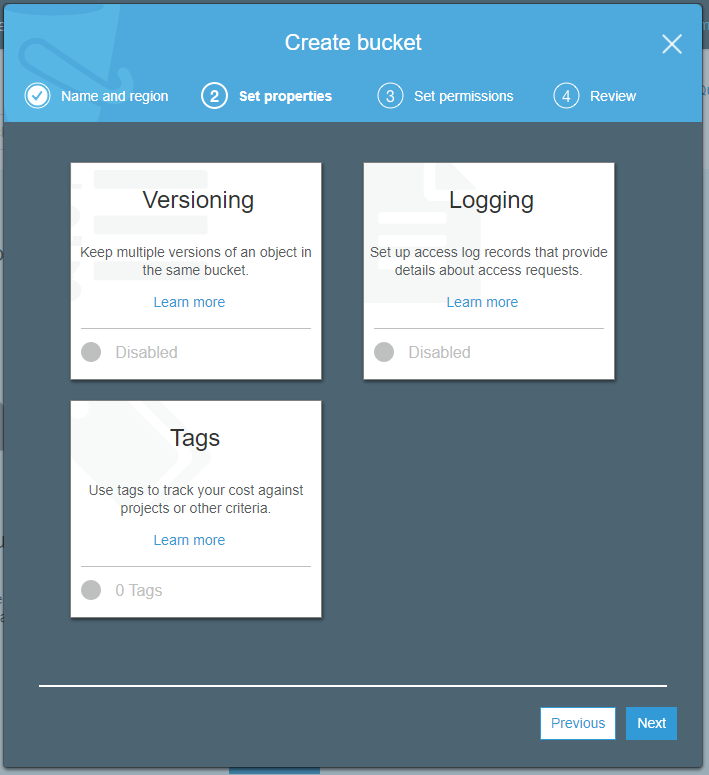
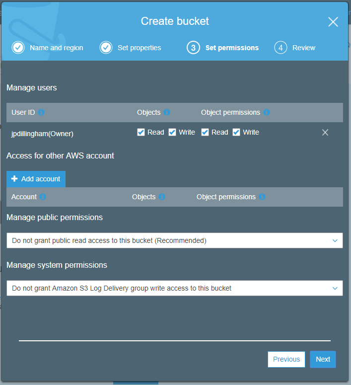
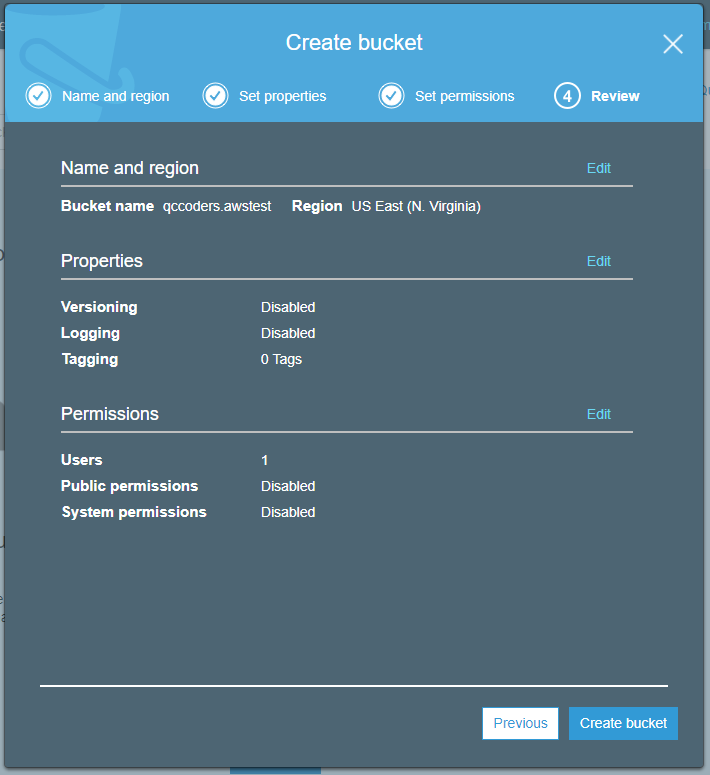

Click to create the bucket.

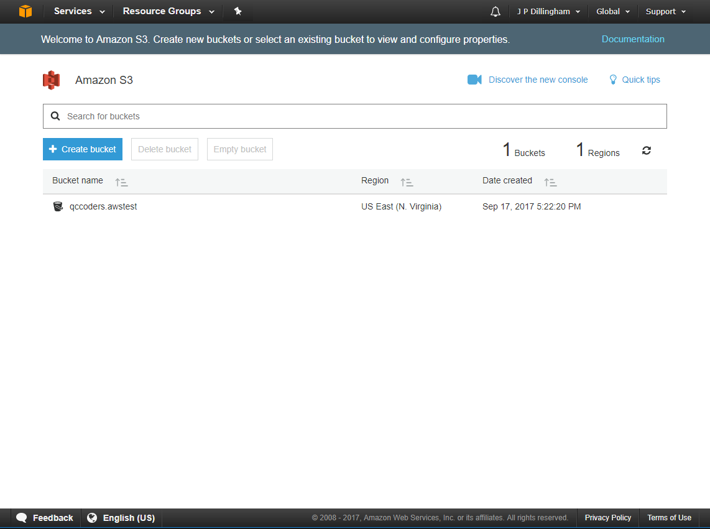

The bucket is created.  Click on the name to navigate into it.

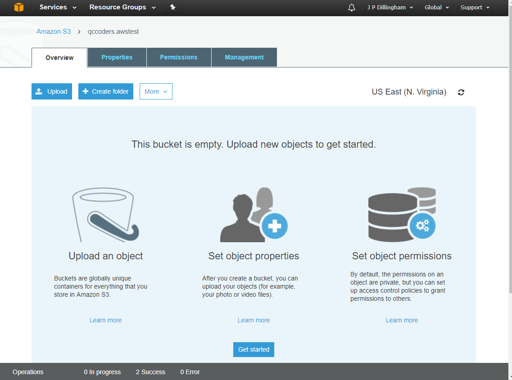

## Put an HTML File in Your Bucket

Create an HTML file.  Any file will do, like this:

```html
<html>
    <title>Q-C Coders Intro to AWS</title>
    <body>
        Hello, World!
    </body>
</html>
```

Upload your file to your bucket.

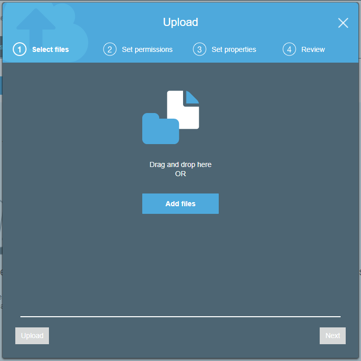

After selecting your file you can click Next to set a bunch of options.  We're just going to click Upload.

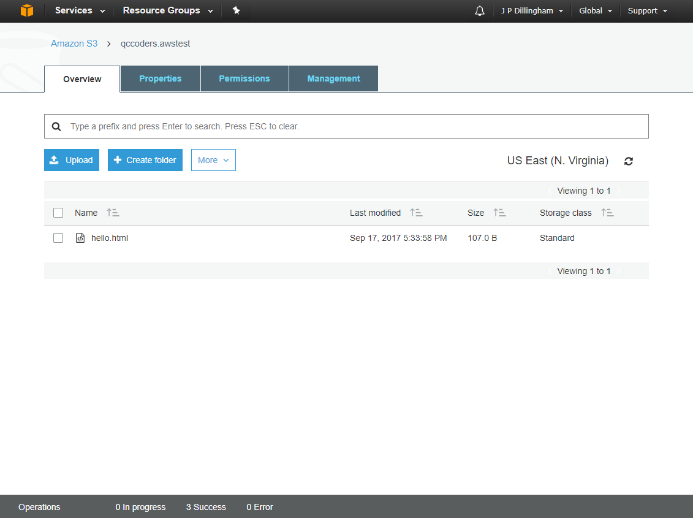

Click on the name of the file to view the properties.

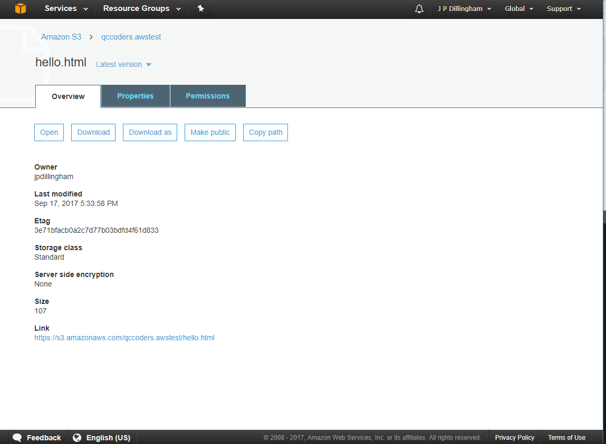

Notice the link at the bottom of the page.  This is the URL at which your file is located.  Click the link.

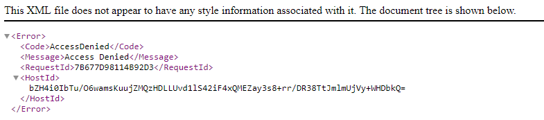

Since we didn't set any permissions initially, our file is not publicly accessible.  Navigate back to the file options.


Click on "Make Public".  You should get a Success message.  Click on the link again.

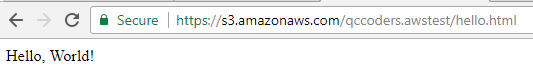

Success! You've just published static web content to AWS S3.


