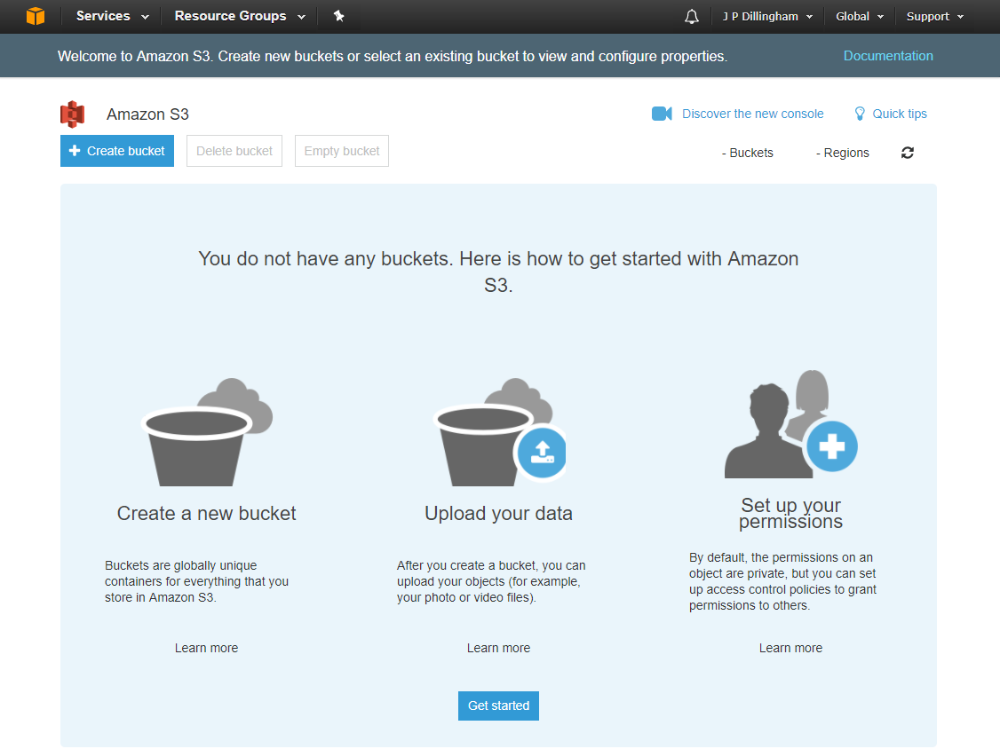

# Intro to AWS
Specifically S3, API Gateway and Lambda.

## Supplemental Reading

[AWS in Plain English](https://www.expeditedssl.com/aws-in-plain-english)

# AWS S3

What is S3? Cloud data storage.  Amazon calls S3 containers "buckets"; these are just named groups of files, like folders but with extra options.

## Create an S3 Bucket

Log in to the AWS Management Console, then open the Services menu and select Storage > S3.



Click to create a bucket.


Select options for the bucket.  For this session we'll accept all of the defaults.


Click to create the bucket.


The bucket is created.

## Put an HTML File in Your Bucket

Any file will do, like this:

```html
<html>
    <title>Q-C Coders Intro to AWS</title>
    <body>
        Hello, World!
    </body>
</html>
```