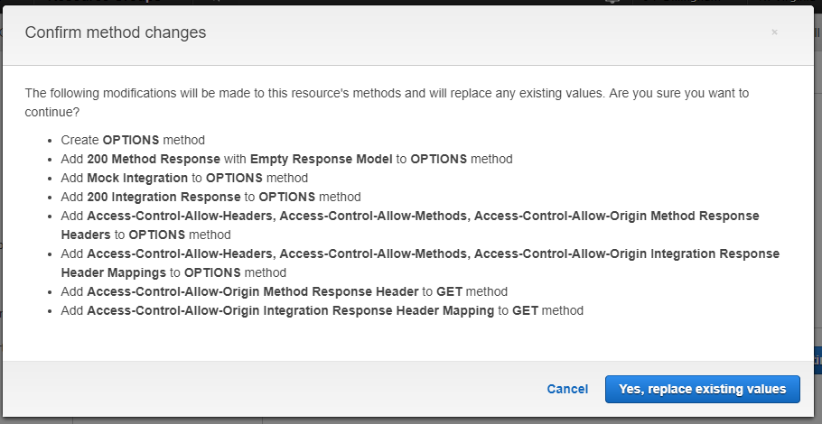
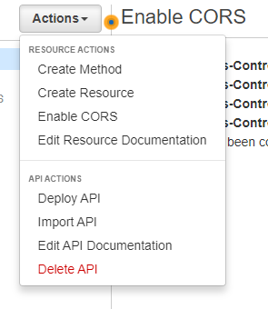

# Tying it All Together

To bring all of the parts; S3, Lambda, and API Gateway, together, we'll update the HTML file we put on S3 to fetch the greeting from our Lambda via the API Gateway.

# Update the S3 HTML File

Modify the HTML file you uploaded to S3 to something like the following:

```html
<html>
    <head>
        <title>Q-C Coders Intro to AWS</title>
    </head>
    <body>
        <div id="text">
            Loading...
        </div>

        <script
            src="https://code.jquery.com/jquery-3.2.1.min.js"
            integrity="sha256-hwg4gsxgFZhOsEEamdOYGBf13FyQuiTwlAQgxVSNgt4="
            crossorigin="anonymous">
        </script>
        <script type="text/javascript">
            $(document).ready(function () {
                $.get("https://ki1fcdtbcc.execute-api.us-east-1.amazonaws.com/qccodersstage")
                    .done(function (data) {
                        $("#text").text(data);
                    })
                    .fail(function(error) {
                        $("#text").text("Error!");
                    });
            });
        </script>
    </body>
</html>
```

This file will use jQuery to fetch the greeting from our API and display it.

# View the Updated HTML File

Navigate to the updated file in your browser.


The API Gateway does not like our cross-origin request.


Navigate back to the API Gateway settings and select your Gateway, click Actions > Enable CORS.


Accept the defaults on the form that appears.



Click Yes.


Check the output and make sure nothing fails.



After enabling CORS the API has to be redeployed.  Click Actions again and select Deploy API.


Select the previously created stage and click Deploy.


Success!