# AWS API Gateway

What is an API Gateway? A set of configurations that define operations (HTTP GET, POST, DELETE, etc.) and the actions that will be taken when those operations are invoked by external clients.

# Prerequisite

Before starting this tutorial, ensure that you have created at least one Lambda function.

# Create an API Gateway

Log in to the AWS Management Console, then open the Services menu and select Application Services > API Gateway.

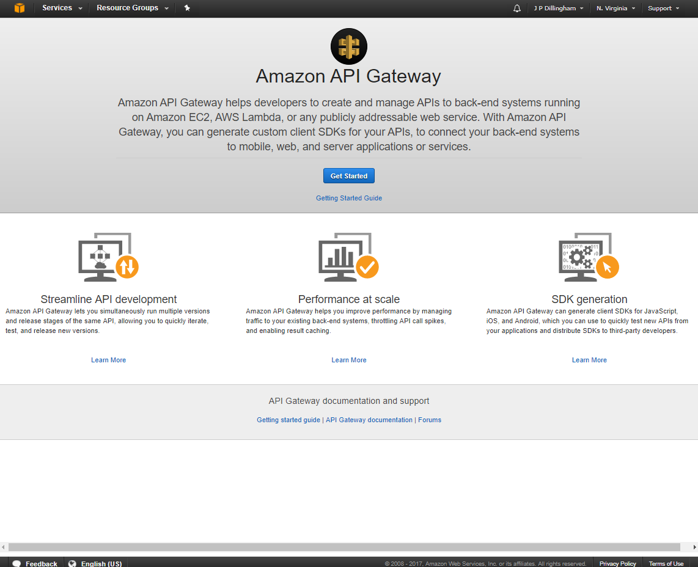

Click Get Started.

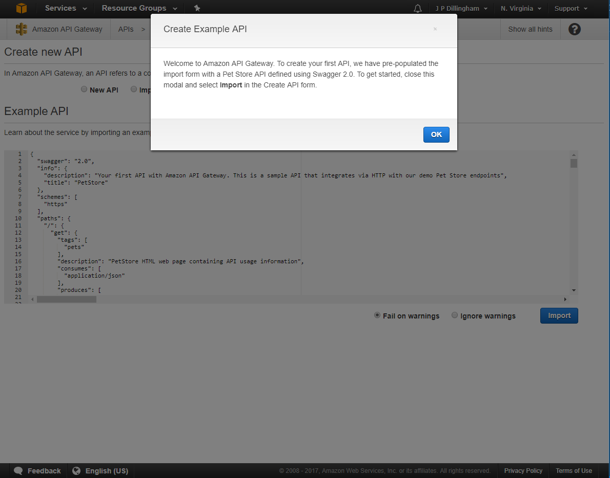

You'll be greeted with a note about creating an example.  Click OK to clear it, then select New API.

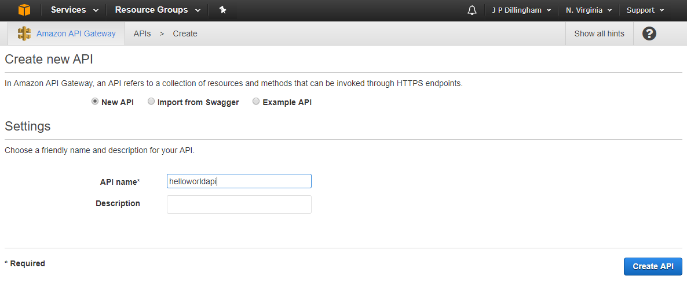

Enter a name, then click Create API.

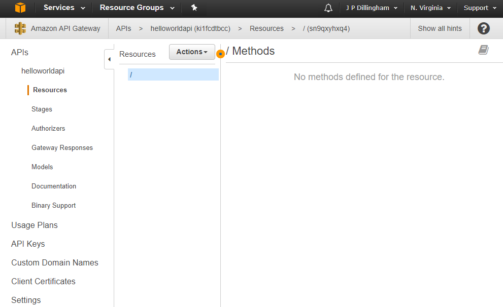

You'll be taken to the API configuration interface.  This interface contains a lot of options, but for now we'll be sticking to the basics.

# Create a GET Method

In the Resources section, click Actions, then Create Method.

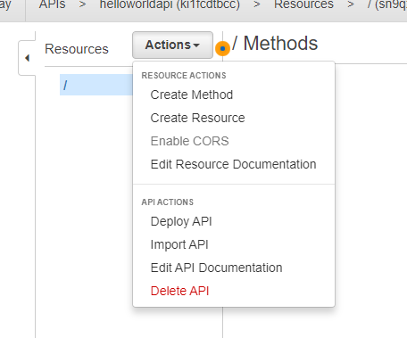

Choose GET from the drop down that is displayed, then click the round checkmark icon to the right of the box to create the method.

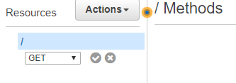

The method will be created.  You'll be prompted to select the integration for the method.

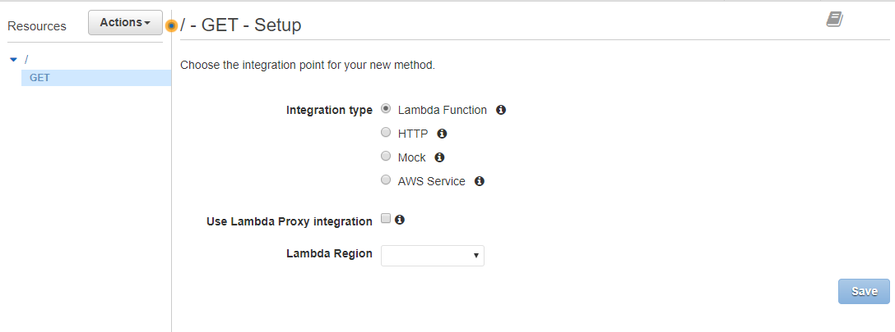

The default is Lambda Function; leave that selected.  Next, you'll need to choose the AWS region in which you've created your Lambda.

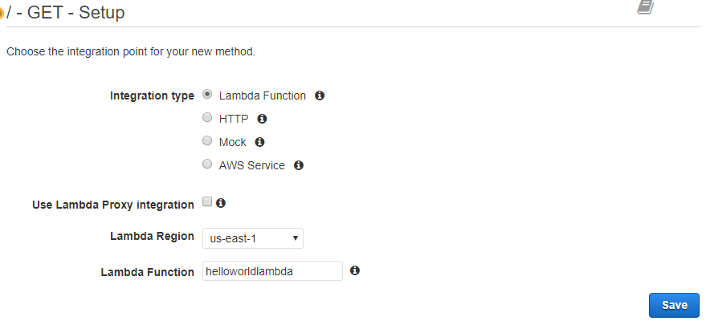

Select (using autocomplete) the name of the Lambda you want to bind, then click Save.  Click OK when prompted about permissions.

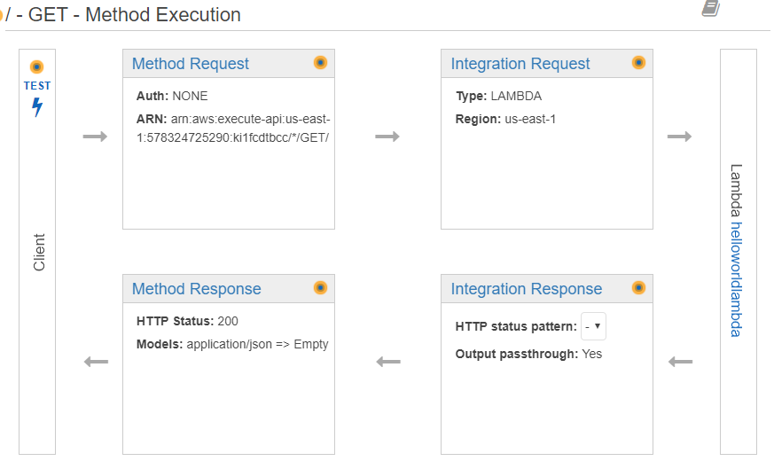

The execution workflow of your API Gateway and Lambda will be displayed.  Click Test and follow the prompts to make sure it is working.

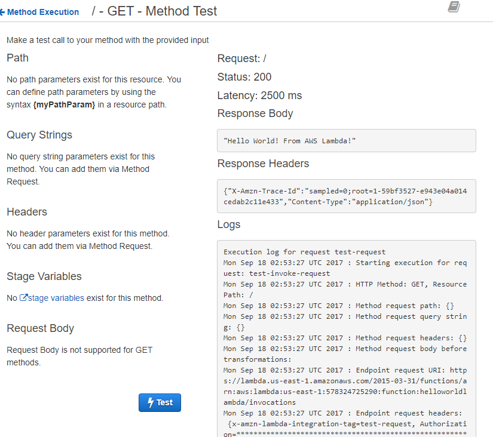

# Deploy your API Gateway

To make the API accessable via the internet, you need to deploy it.  Select Actions > Deploy API.

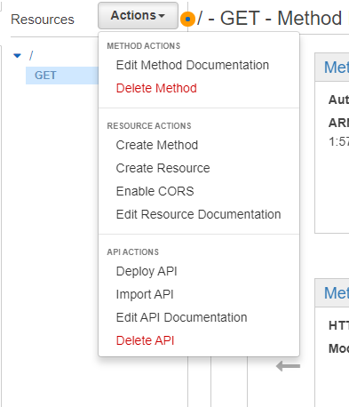

Select [New Stage] and enter a name, then click Deploy.

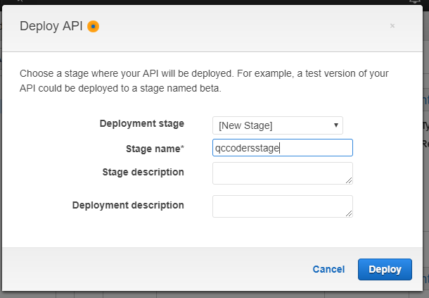

The API will then be deployed, and you'll be given a URL with which to invoke your method.

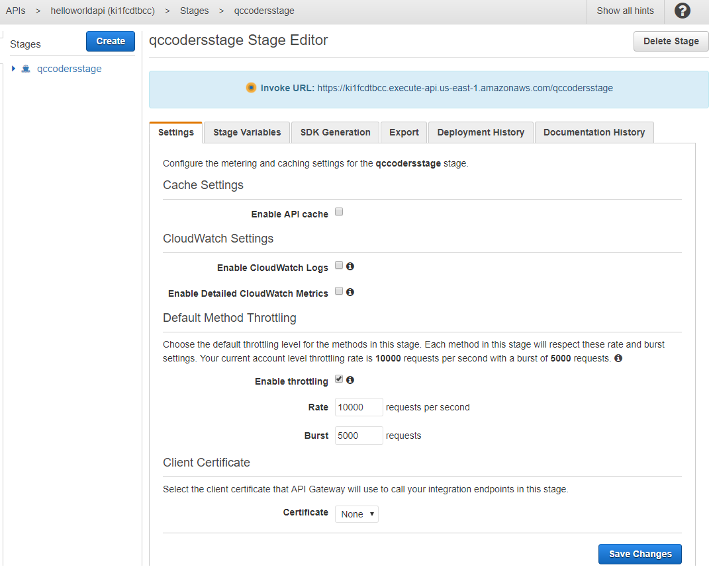

Navigate to the URL and verify that the return value from your Lambda function is returned by the API Gateway.

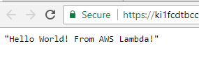

Success!  You've exposed your Lambda to the internet via an API Gateway.

