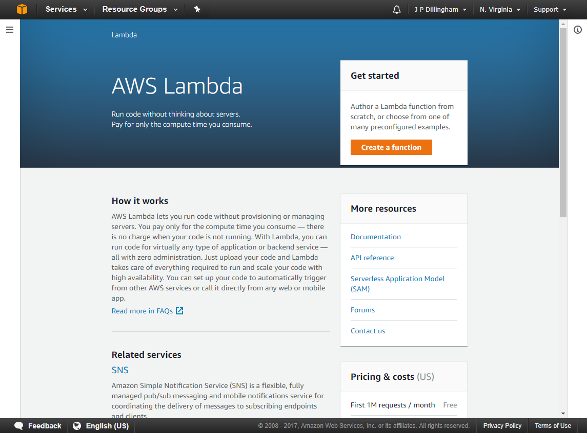
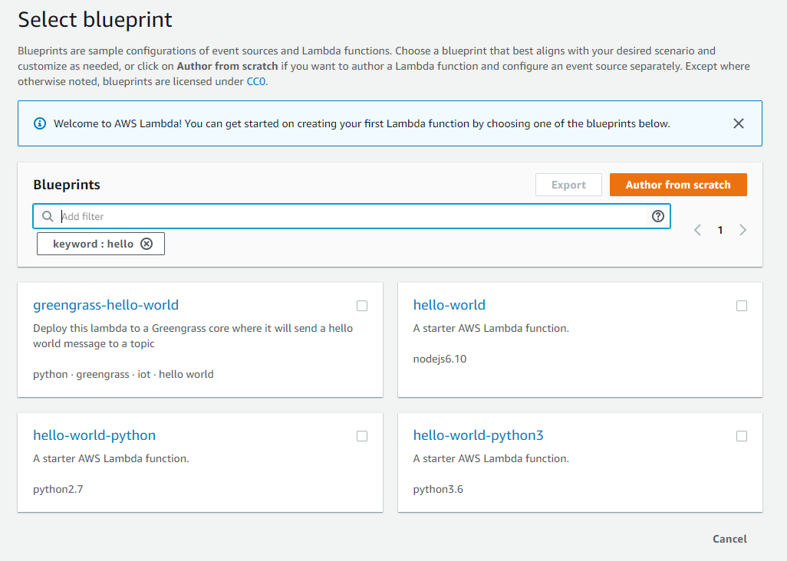
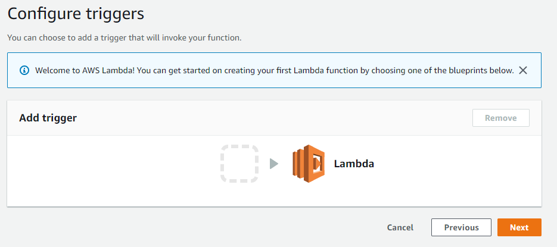
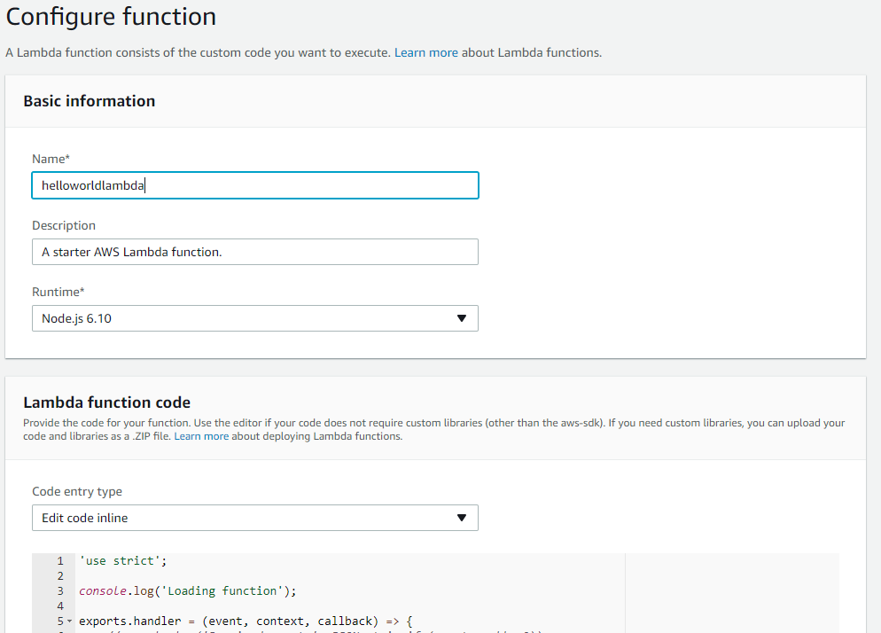
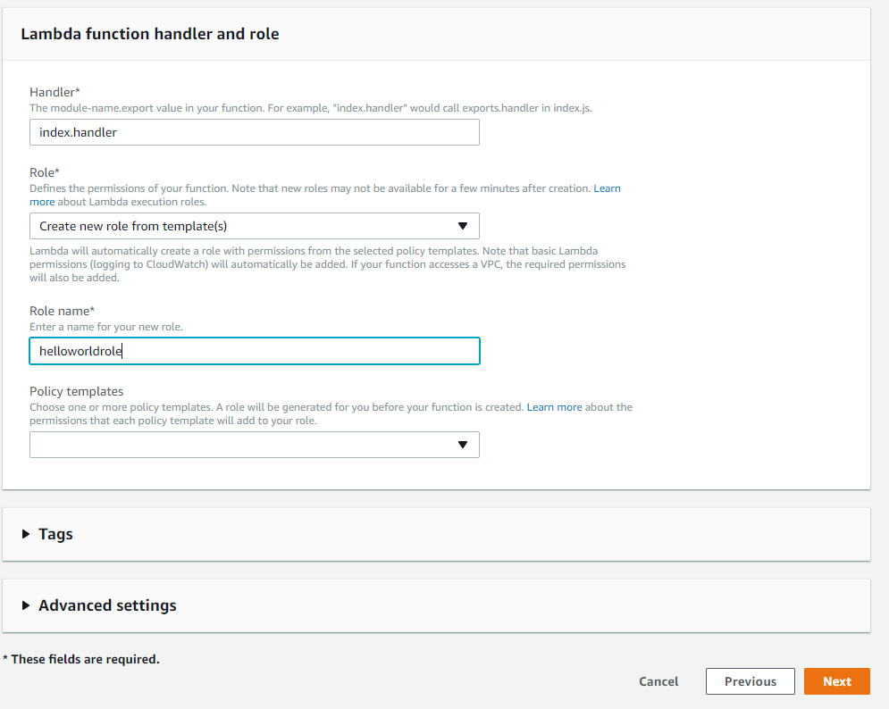
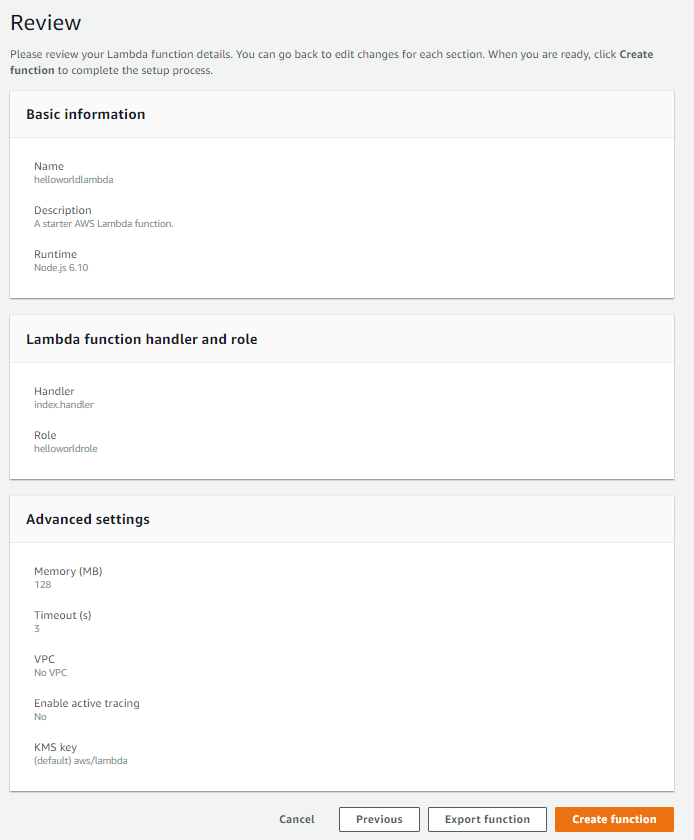
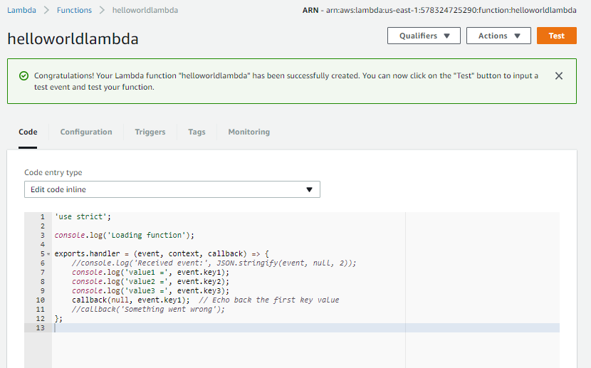
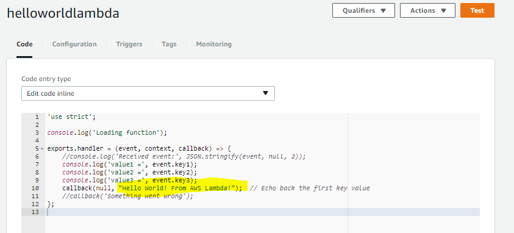
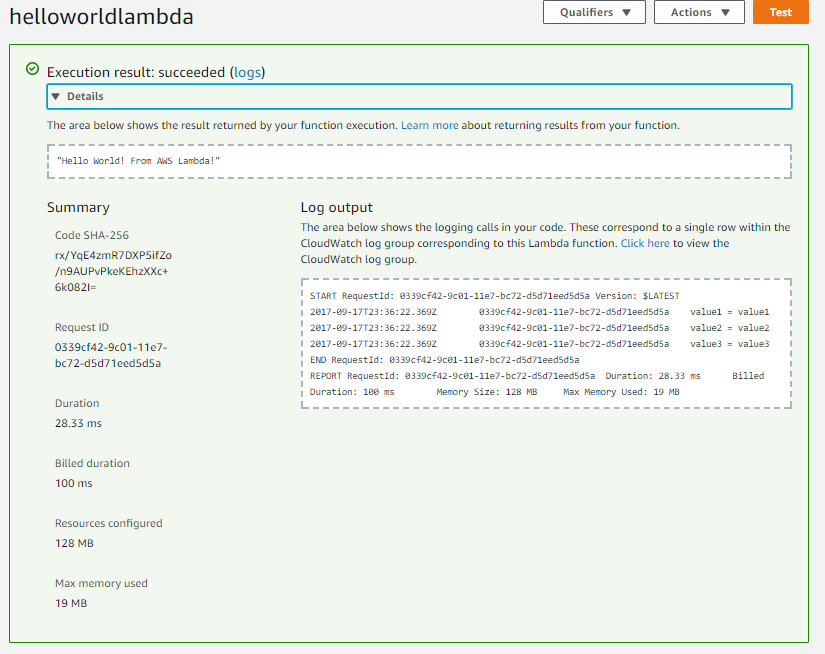

# AWS Lambda

What is AWS Lambda? A serverless function.  A Lambda runs on demand, accepting whatever inputs you send, performing the operations you define in your code, and returning a result.

# Create a Lambda Function

Log in to the AWS Management Console, then open the Services menu and select Compute > Lambda.



Click Create a function.  AWS will prompt you to select a "blueprint" to get started; enter "hello" in the search box and select the "hello-world" blueprint for nodejs6.10.



You'll be prompted to enter a few things, including a name and the name of the role under which the Lambda runs.



Click Next.



Enter a name and scroll to the bottom.



Make sure "create from template(s)" is selected, then enter a name for the role and click Next.



Review settings, then click Create function.



# Modify Your Lambda's Return Value

You're now presented with the code which will run when you execute your Lambda.  We aren't going to do much here; only update the return value to return a phrase of our choosing.



```callback(x,y)``` is the function that returns a value from your Lambda.

# Save and Test Your Lambda 

Save your function, then use the Test button to run it.  Expand the results and make sure it returns the text you entered.



Success! You've created a Lambda function!
